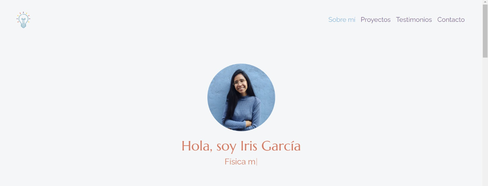
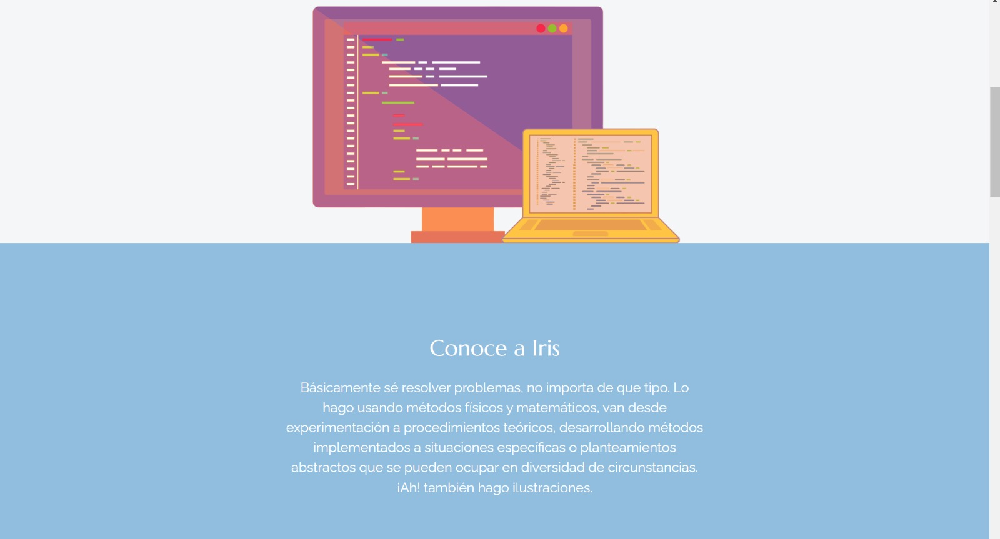
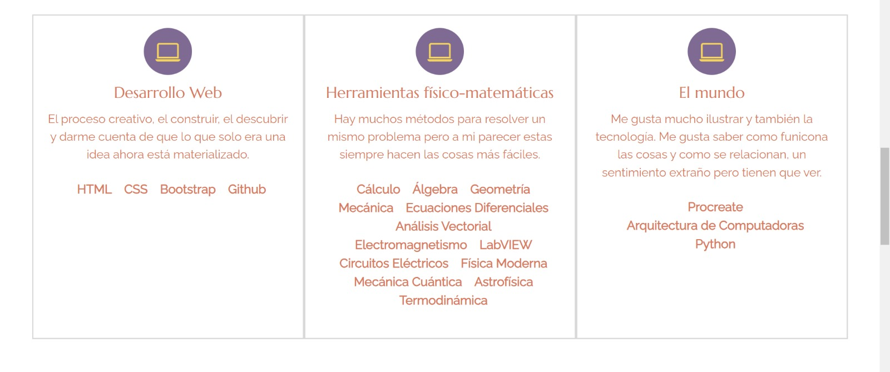
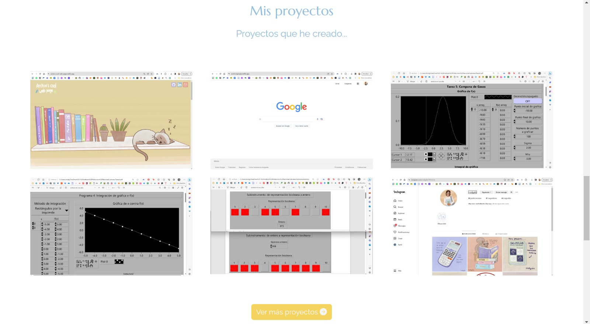
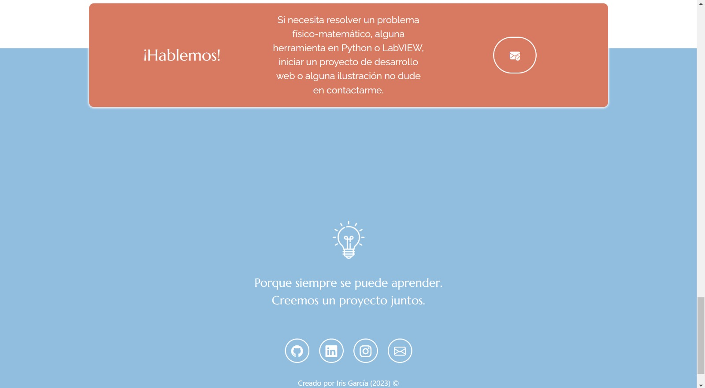

# 💼 Portafolio Responsive con Bootstrap 5
Esta página web fue creada para el bootcamp Tecnolochicas PRO, esta se puede adaptar al tamaño de pantalla de los distintos dispositivos sin perder su estructura.
El propósito de esta págino es mostrara mi portafolio de desarrolladora web y mi experiencia en otras áreas. Se puede ingresar mediante el siguiente link: https://portafolio-iris-garcia.netlify.app/

### 💻 Contenido:

Encabezado de la página web:

Motivación:

Experiencia:

Proyectos:

Contacto:

## 👩🏽‍💻 Tecnologías:

Esta página web fue creada con:

* HTML
* CSS
* JavaScript 
* Bootstrap 5

Además, se incluyeron **Google Fonts** para personalizar la fuente y **Bootstrap icons** para incorporar íconos como flechas y logos de redes sociales populares. 
